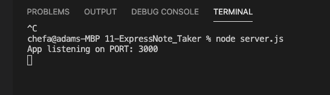
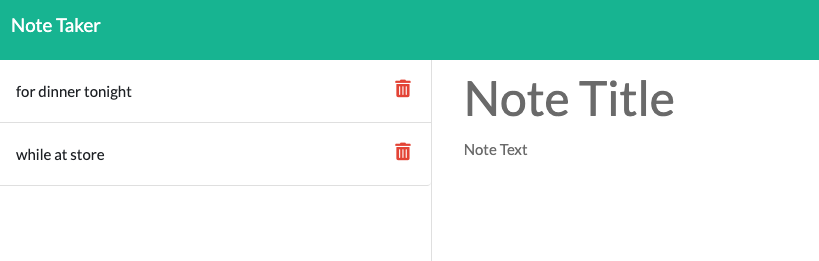
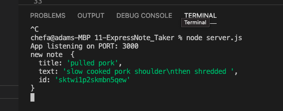

Express.js: Note Taker

## Description
This application will allow a user to create, edit and delete notes written in a database and stored on the server side. The app is then to be deployed on Heroku for user access.

## My Task

Modify starter code to create an application called Note Taker that can be used to write and save notes. This application will use an Express.js back end and will save and retrieve user note data to and from a JSON file.

The application’s front end has already been created however contained some bugs that needed to be fixed in order for the app to run. My job is to build the back end, connect the two, and then deploy the entire application to Heroku.

The following images show the web application's appearance and functionality: 

### Img Listening on Port 3000

### Img Notes.html page with saved notes

### Img Terminal showing note with title, text and Uniqu ID

## Technoligies/Database

Using `db.json` file on the back end to store and retrieve notes using the `fs` module.

The following HTML routes should be created:

* `GET /notes` should return the `notes.html` file.

* `GET *` should return the `index.html` file.

* `GET /api/notes` to read the `db.json` file and return all saved notes as JSON.

* `POST /api/notes` to receive a new note and save on the request body, add it to the `db.json` file, and then return the new note to the client. 
To accomplish this I used the `npm` to create a unique ID at [npmjs](https://www.npmjs.com/package/uniqid) using `uniqid`

* See it Deployed at: `Heroku` [https://polar-wave-99684.herokuapp.com/](https://polar-wave-99684.herokuapp.com/)

## Conclusion
This is app is ready to go- only one extra part to add is to work in the delete function. 

